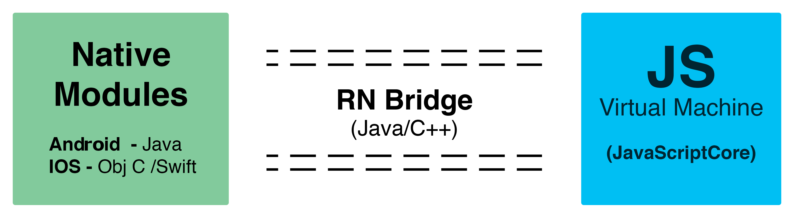

# React Native Internals

`<Introduction>`

React Native is a framework which allows developers to build native apps using Javascript. Wait! Cordova already does that
and has been around for quite a while. Why will anyone want to use RN ?

The primary difference between RN and Cordova based apps is that Cordova based apps run inside a webview while RN apps render using native views. RN apps have direct access to all the Native APIs and views offered by the underlying mobile OS. Thus, RN apps have the same feel and performance of the native application.

At first, it is easy to assume that react native might be compiling JS code into the respective native code directly. But this would be really hard to achieve since Java and Objective C are strongly typed languages while Javascript is not ! Instead RN does something much much clever. React Native essentially can be considered as a set of React components, where each component represents the corresponding native views and components. For example, a native TextInput will have a corresponding RN component which can be directly imported onto the JS code and used like any other react component. Hence, the developer will be writing the code just like for any other React web app but the output will be a native app.

Ok ! This all looks black magic 🙄.

To understand this, lets take a look at the architecture and how react native works internally.

### Architecture 🤖

Both IOS and Android have a similar architecture with subtle differences.

If we consider the big picture, there are three parts to the RN platform:

1. **Native Code/Modules** :
  Most of the native code in case of IOS is written in Object C or Swift. While in case of android it is Java.
  But for most cases we will not need to write any native code while writing our react native app.

2. **Javascript VM** :
  The JS Virtual Machine that runs all our JavaScript code.
  On iOS/Android simulators and devices React Native uses JavaScriptCore, which is the JavaScript engine that powers Safari.
  JavaScriptCore is an open source JavaScript engine originally built for WebKit.
  Incase of IOS, React Native uses the IOS platform - provided JavaScriptCore.
  It was first introduced in IOS 7 along with OSX Mavericks.<br/>
  https://developer.apple.com/reference/javascriptcore.

  In case of Android, React Native bundles the JavaScriptCore along with the application. This increases the app size. Hence the hellow world application of RN would take around 3 to 4 megabytes.

  In case of Chrome debugging mode, the JavaScript code runs within Chrome itself (instead of the JavaScriptCore on the device) and communicates with native code via WebSocket. So, here it will use the V8 engine. This allows us to see a lot of information on the chrome debugging tools like network requests, console logs ,etc. 😎

3. **React Native Bridge** :
  React Native bridge is a C++/Java bridge which is responsible for communication between the native and Javascript thread.
  A custom protocol is used for message passing.

<br />
<div style="text-align:center">

</div>
<br/>

In most cases, a developer would write the entire react native application in Javascript. To run the application one of the following commands are issued via the cli - `react-native run-ios` or `react-native run-android`. At this point React native cli would spawn a node packager/bundler that would bundle the js code into a single `main.bundle.js` file. The packager is basically a customized version of webpack. Now, whenever the react native app is launched, at first the native entry point view is loaded. The Native thread spawns the JS VM thread onto which the bundled JS code is run. The JS code has all the business logic of the application. The Native thread now sends messages via the RN Bridge to start the JS application. Now the spawned Javascript thread starts issuing instructions to the native thread via the RN Bridge. The instructions include what views to load, what information to be retrieved from the hardware, etc. For example, if the js thread wants a view and text to be created it will batch the request onto a single message and send it across to native to render them.

`[ [2,3,[2,'Text',{...}]] [2,3,[3,'View',{...}]] ]`

The native thread will perform these operations and send the result back to the JS assuring that the operations have been performed.

*__Note__: To see the bridge messages on the console, just put the following snippet onto the `index.<platform>.js` file*
```
import MessageQueue from 'react-native/Libraries/BatchedBridge/MessageQueue';
MessageQueue.spy(true);
```

### Threading Model 🚧

Three threading queues
UI Events(Native Queue)  ------ React Native Modules(Queue) -------  JS Event Queue

1. (UI Queue) UI Touch -> JS Event handler (Dispatched changes required) --> Native Modules Queue (Recomputes the layout using css layouting) ---> Update the UI (UI Queue)


Alternate threading (https://www.youtube.com/watch?v=0MlT74erp60)

1.Main Thread - The Native app thread -- this loads the app and starts up JS thread to load js code

2.JS Thread - Starts up , all the logic in JS also performs React rendering

3.Shadow Thread - Computes the layout in shadow nodes (does math where to render the component,etc) -- finally gives instruction to main thread to render the View

4.Custom Native Modules - can have their own threads


Native Modules

View Managers map JS/JSX Views  to Native Views

for example <Text /> ---> new TextView(getContext())


Development mode (dev=true)

JavaScript thread performance suffers greatly when running in dev mode. This is unavoidable: a lot more work needs to be done at runtime to provide you with good warnings and error messages, such as validating propTypes and various other assertions.


DaveKerr blog article to be incorporated for managing build files
http://www.dwmkerr.com/tips-and-tricks-for-beautifully-simple-mobile-app-ci/


Performance -
1.Keys in list
2.Should component Update
3.


Source -- https://www.youtube.com/watch?v=8N4f4h6SThc - RN android architecture video
