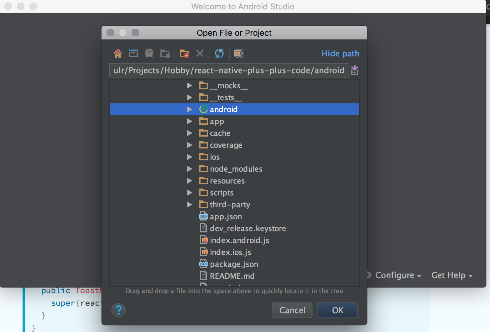

# Android Native Modules

Let's say we want to build a native module that gets you the **device name**.

Before we continue, remember that if you want to write code for Android, you need to open the android project in Android Studio. This is because Android Studio is built for Android development and it will help you resolve all the trivial errors that otherwise would take too much time to resolve.

## Let's get started

1. Open the `./android/` project in Android Studio.

   

2. Create a Java class file `android/app/src/main/java/com/notetaker/device/DeviceModule.java` **This is our main custom native module file**. The custom native module class should extend `ReactContextBaseJavaModule`. After this, we will have to implement the `getName()` method.

   The `getName` method basically contains the name by which the module will be exported to the JS.

   In order to expose a method from a native Java module to Javascript, just write a method and add `@ReactMethod` annotation on top of it.

   These methods can be accessed from `NativeModules` of the `react-native` package. See the example below:

   > android/app/src/main/java/com/notetaker/device/DeviceModule.java

   ```java
   package com.notetaker.device;

   import com.facebook.react.bridge.Callback;
   import com.facebook.react.bridge.ReactApplicationContext;
   import com.facebook.react.bridge.ReactContextBaseJavaModule;
   import com.facebook.react.bridge.ReactMethod;

   public class DeviceModule extends ReactContextBaseJavaModule {
      //constructor
      public DeviceModule(ReactApplicationContext reactContext) {
          super(reactContext);
      }
      //Mandatory function getName that specifies the module name
      @Override
      public String getName() {
          return "Device";
      }
      //Custom function that we are going to export to JS
      @ReactMethod
      public void getDeviceName(Callback cb) {
          try{
              cb.invoke(null, android.os.Build.MODEL);
          }catch (Exception e){
              cb.invoke(e.toString(), null);
          }
      }
   }
   ```

   Here we are exporting a method `getDeviceName()` from native to Javascript. This method can be accessed in JS via

   ```javascript
   import {NativeModules} from 'react-native';
   NativeModules.Device.getDeviceName((err ,name) => {
      console.log(err, name);
   });
   ```

   NativeModules has a key named 'Device'. This is basically the same name we exported using the method `getName`. And `getDeviceName` is exported because of `@ReactMethod`.

   We passed a callback to get the value from the NativeModule.

3. But creating a module file is not enough. Before a native module can be used we need to register the module. To do this we create another Java class

   > android/app/src/main/java/com/notetaker/device/DevicePackage.java

   ```java
   package com.notetaker.device;

   import com.facebook.react.ReactPackage;
   import com.facebook.react.bridge.JavaScriptModule;
   import com.facebook.react.bridge.NativeModule;
   import com.facebook.react.bridge.ReactApplicationContext;
   import com.facebook.react.uimanager.ViewManager;
   import java.util.ArrayList;
   import java.util.Collections;
   import java.util.List;

   public class DevicePackage implements ReactPackage {

      @Override
      public List<ViewManager> createViewManagers(ReactApplicationContext reactContext) {
          return Collections.emptyList();
      }

      @Override
      public List<NativeModule> createNativeModules(
              ReactApplicationContext reactContext) {
          List<NativeModule> modules = new ArrayList<>();
          //We import the module file here
          modules.add(new DeviceModule(reactContext));

          return modules;
      }

      // Backward compatibility
      public List<Class<? extends JavaScriptModule>> createJSModules() {
          return new ArrayList<>();
      }
   }
   ```

   This file just imports our module and instantiates it.

4. The last step in the registration process is to instantiate our `DevicePackage` class.

   To do this modify the file

   > android/app/src/main/java/com/notetaker/MainApplication.java

   ```java
   ...
   ...
   import com.notetaker.device.DevicePackage;
   ...
   ...
   ...

      @Override
      protected List<ReactPackage> getPackages() {
        return Arrays.<ReactPackage>asList(
            new MainReactPackage(),
            ...
            ...
            new DevicePackage() //Add your package here
        );
      }
    };
   ...
   ...
   ...
   ```

## That's it, let's give it a shot!

In a Javascript file, you can access the module methods using `NativeModules.<moduleName>.<methodName>`

> app/index.js

```javascript
import {NativeModules} from 'react-native';
...
...
  NativeModules.Device.getDeviceName((err, name) => console.log(err, name));
...
...
```

Running this on an Android emulator returns


Woot! That was simple!

The code till here can be found on the **branch** [chapter/16/16.1](https://github.com/react-made-native-easy/note-taker/tree/chapter/16/16.1)

> Note that if you try to build for iOS now, the build will fail as we have not implemented the Device module in iOS yet.

