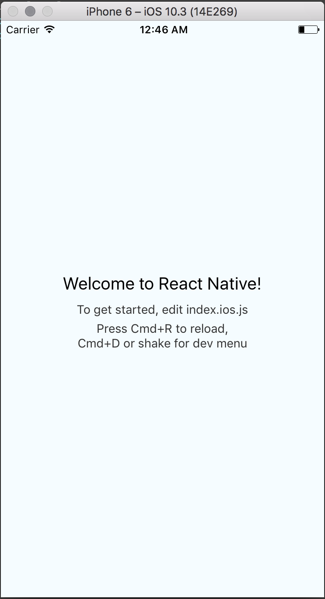
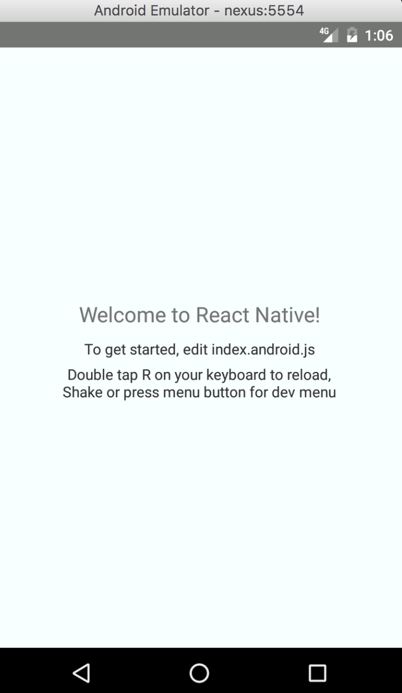

# Project Structure 🏢

We will be creating a note-taking App in React Native. Let's call it `NoteTaker`. By the end of this book, we will be able to build and deploy the NoteTaker to the Android Play Store and the Apple App Store for users to download. We will begin with the standard React Native boilerplate and as we progress through the concepts we will keep updating it. Also, at the end of the book, we will show how to extend our app originally written in Android and iOS to any other platforms, for example, web \(because we just love web\). So, let us begin.

## Boilerplate

To create a new project run `react-native init <project-name>`. Example: `react-native init notetaker`. We will use this as our base project in this book. Once the project setup is complete you should have a project structure similar to this.

```text
.
├── .babelrc
├── .buckconfig
├── .flowconfig
├── .gitattributes
├── .gitignore
├── .watchmanconfig
├── android
├── ios
├── node_modules
├── __tests__
│   ├── index.android.js
│   └── index.ios.js
├── app.json
├── index.android.js
├── index.ios.js
├── package.json
└── yarn.lock
```

## Run the app

First, let's run the project to see how it looks.

Type the command

`react-native run-ios` - for running the app on iOS simulator

or

`react-native run-android` - for running the app on a connected Android phone/emulator.

Note that for `react-native run-android` to work, you should have an open Android emulator or an Android device with USB Debugging enabled connected to your system via a USB cable.

If all goes well you should see the following screen on your iOS or Android emulator.





If you noticed there are two entry point files `index.ios.js` and `index.android.js`. Hence, when we run the command `react-native run-ios`, the file `index.ios.js` serves as our entry point.

_**Note: The above is applicable only to React Native 0.49 and below. Later versions have only one entry point **_`index.js`

Under the hood, when we run the command `react-native run-ios`, the iOS native project inside `ios` directory starts compiling. Along with the native project, react-native packager kicks in on another terminal window and runs on port `8081` by default. The packager is responsible for the compilation of JavaScript code to a js bundle file. When the native project is successfully launched on the simulator, it asks the packager for the bundle file to load. Then all the instructions inside the js code are run to successfully launch the app.

The code till here can be found on the **branch** [chapter/5/5.0](https://github.com/react-made-native-easy/note-taker/tree/chapter/5/5.0)

